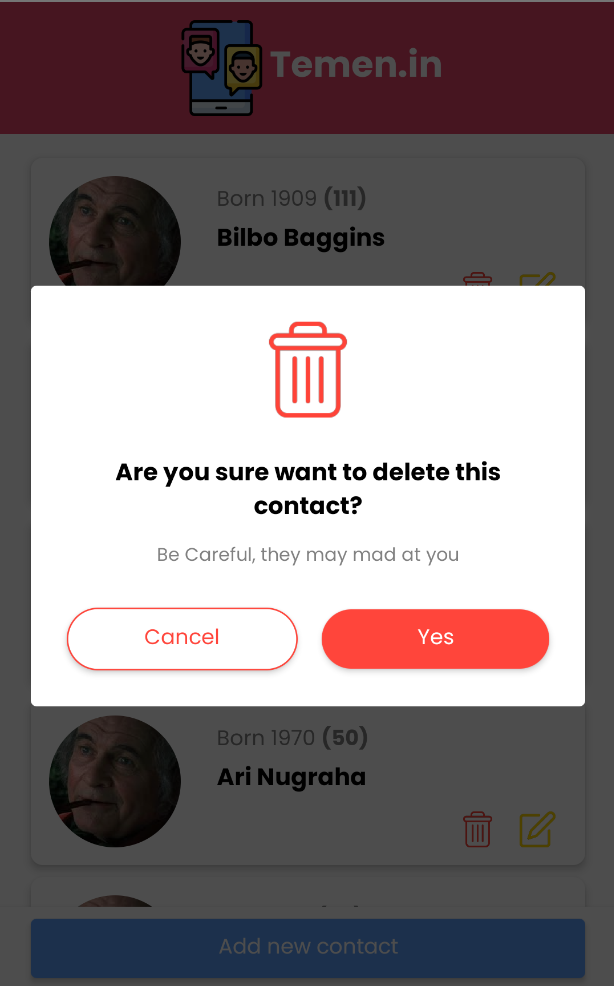

This is a react native project about contact app, my focus is building this app on android.
## Getting Started

First, run:
```bash
npm install
# or 
yarn install
```

Then, run the development server:

```bash
npm run android
# or
yarn android
```





